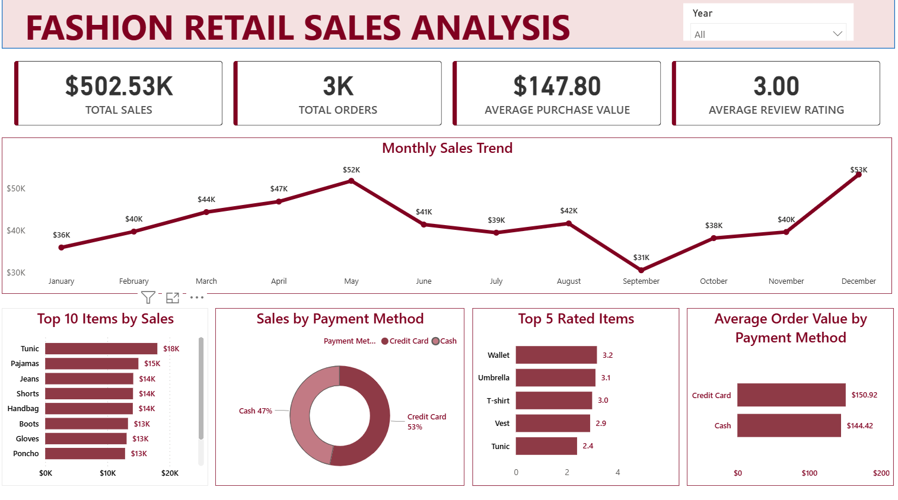

# Fashion Retail Sales Analysis
## Project Overview
This project analyzes fashion retail sales data to uncover trends in revenue, customer behavior and product performance. The dashboard was built using Excel and Power BI to provide actionable insights for business decision making.
## Key Objectives
* Analyze total sales performance and identify top selling products
* Understand customer purchasing patterns
* Compare payment methods and their impact
* Track Monthly sales trneds
## Dataset Information
This dataset used here was gotten from a professional network and it contains retail transaction data of 3400 rows.
## Data Cleaning and Preparation
Data Cleaning and Preparation was completed in Microsoft Excel to ensure accuracy, Steps included;
* Checking for duplicates and making sure there was none
* Validating spending values to ensure all transactions reflected positive amounts
* Handling missing values in Review Rating and Purchase Amount to ensure accurate figures
* Converting date formats to ensure visual accuracy
* Created Columns like month and year to give a good visual representation
## Tools Used
* Microsoft Excel (Data Cleaning and Data Exploration)
* Power BI (Data Analysis and Data Visualization)
## Key Insights
## OVERALL SALES PERFORMANCE##
* The business generated $502.53K in total sales from approximately 3,000 orders
## SEASONAL SALES TREND##
* Sales gradually increased from January to May, reaching $52K in May
* The lowest sales occurred in September($31K)
* Sales peaked again in December indicating strong seasonal demand during the holiday period
## TOP PERFORMING PRODUCTS##
* Tunics, Pajamas and jeans were among the highest revenue generating items. These products contribute significantly to Overall sales
## CUSTOMER PAYMENT PREFERENCE##
* Credit card payments accounted for 53% of transactions, while cash accounted for 47%
This suggests that customer slightly prefer digital payment methods
## CUSTOMER SPENDING BEHAVIOUR##
* Customers paying with credit card had an average order value of $150.92 compared to cash payments of $144.42
## PRODUCT RATINGS##
* Items such as Wallets, Umbrellas and T-shirts received the highest customer ratings indicating strong customer satisfaction with this products
## Business Recommendations
* Increase Inventory for Top selling Items maintaining adequate stock levels can help prevent missed revenue opportunities
* Leverage Seasonal sales opportunities; Sales peak in May and December suggests seasonal demand. The business can maximize revenue by planning targeted marketing campaigns during these period												
* Promote digital payments method since credit card users tend to spend slightly more per order. Encouraging it could increase overall revenue
* Improve Low Rated Products: Products with lower ratings should be reviewed to identify quality ordesign issues that may affect customer satisfaction
## DASHBOARD

